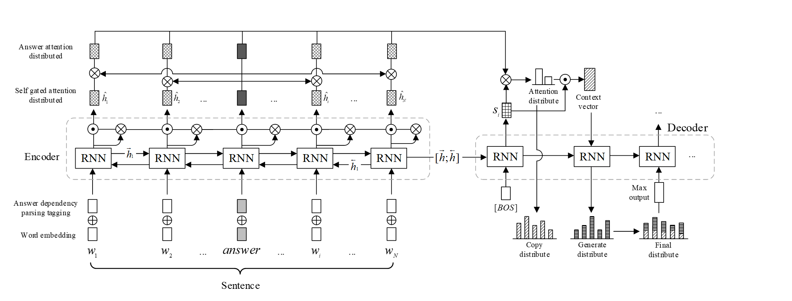

# 基于答案信息扩充的中文问题生成
> 注： 该论文目前已经投稿在《ACM Transactions on Asian and Low-Resource Language Information Processing》

如使用本项目的源码，请注明出处：
> Y. Li, M. Shi, X. Huang, L. Dong, and X. Jiang, “Chinese Question Generation with Answer-Extended Information at paragraph level” submitted to ACM Transactions on Asian and Low-Resource Language Information Processing, Jun. 2022
## 1. 项目介绍
  问题生成是自然语言处理中文本生成方向的一个研究分支，旨在让机器理解一段自然语言并提出相关问题。
  目前大部分的研究使用Seq2Seq结构，结合注意力机制、覆盖机制等方法产生问题，
  当要求模型产生的问题和答案相匹配时，使用Seq2Seq模型产生的问题会出现和答案的匹配度不高的问题，
  尤其是当输入的句子较长且答案较短时，模型能获得的答案信息有限，导致产生的问题偏离了预设的答案，
  一定程度上影响了问题生成的性能。为了解决这个问题，本文提出了一种基于句法依存分析的答案标注策略，
  用于标注原句中和答案相关的文本，同时设计了一种扩充答案信息的模型，添加了答案扩充的自注意力机制，
  通过该机制获取原句中和答案相关的语义信息。
  实验结果表明，本文设计的模型分别在SQuAD和DRCD数据集中将BLEU-4提升了1.15%和1.79%。
## 2. 模型架构

## 3. 模型输出
> Example 1
- 输入：新北市总人口中客家人口约占14.1％，虽非全台湾最高，但总人口数为全台湾第二多，仅次于桃园市；新北市客家人分布较为分散，主要区域包括新庄、三重、三峡、新店安坑、汐止、泰山、五股、土城、深坑等地；另外东北角石门、金山一带亦有少数客家人迁徙至当地定居。新北市的原住民人口占总人口比例1.29%，以泰雅族为主，主要分布在乌来区；乌来区同时也是新北市唯一的直辖市山地原住民区。另外，新北市新住民人口约有九万七千多人，为台湾新住民最多的城市，若把新住民子女及新移工纳入，总人口数超过20万人。另外中和区的华新街，为早期南洋华侨迁居来此地定居逐渐形成的聚落，尤其以缅甸人为主，每年「泼水节」活动为商圈重要节庆；永和区的中兴街则为早期韩国华侨的聚集所在，又有『韩国街』之称。
  - 期望输出：台湾哪一行政区所拥有的客家人口比例是最高的？
  - 模型输出：台湾哪一地区的客家人口数为全台湾第一？
> Example 2
- 输入: 马祖地区属亚热带海洋性气候，四季分明，冬冷潮湿，春夏交际多雾，秋天气候平均较为稳定。马祖的纬度略高于台湾北部，惟因靠近中国大陆的大陆型气候，气温比台北低，年平均温度为摄氏18.6度，早晚温差亦大，每年气温12月至2月间最低，3月份以后慢慢上升；7、8月气温最高，月平均温度在29度左右，此后逐渐下降，2月份月均温最低，仅10度左右。风速在10月至翌年3月间，大陆冷气团南下，有强烈东北季风吹袭，故风速最大；尤其是3至5月间，开始吹南风形成多云雾的天气，即为平流雾。每年春天，南风从台湾海峡带来暖湿空气，和气温较低的马祖地面、水域接触，便形成浓雾。平流雾的厚度可达七、八百公尺以上，天气好时的日间太阳辐射最多只能消除云层顶部一部分，因此；如果平流雾历久不散，能见度骤降，这就是为何马祖地区的航班常常于此季节飞飞停停的原因。马祖地区全年降雨量多集中于4至5月，台风则多发生于7、8月，年平均雨量约1060公厘，不到台湾雨量的一半，雨季集中在4至9月的梅雨季及台风季。
  - 期望输出：在什么时间点去马祖地区可以感受到较稳定的气候？
  - 模型输出：马祖地区在哪一个气候平均较为稳定?

# 2. Data Size 和 训练数据
18478 - train 
Vocab Size  45000
---
trail_time = 12 BLEU_score: 0.085

|trail_time| gated_self_attention|local coverage mechanism|BlEU score|ROUGE score|Meteor score|
|------|------|------|------|------|------|
|12|yes|yes|size 5: 0.085|--|--|
|13|yes|global|size 5: 0.083|--|--|
|14|yes|local |size 5:0.081|||
|15|no| local|size 5: 0.074|||
|16|yes|yes| size 5: simple 0.5|||
|17|yes|no|0.020|||
|18|yes|yes|0.085|||
|19|yes|yes local step 5| 0.088|||
|22|yes|yes 没有使用答案标注|0.038||
|24|yes|yes graph yes|0.090||

用了forcing ratio 整体损失在上升
```shell
tensorboard --logdir /home1/liyue/Lee_NQG/debug/tensorboard --host 10.20.13.18
```
coverage loss recoder
- one batch:
```text

```

---
# 版本说明
- version : `V1`: 第26次实验，效果比较好是因为添加了K交叉验证
    - 本次版本只是为了验证第26次实验的效果
    - 添加了graph， `input_a`
    - 添加了评估代码，文件夹为 qgvalcap ,之前的评估代码出现错误
    - 之前版本的文本推理方式，导致不能直接用已经写好的评估代码评估，因此这个修改了文本生成结果的存储方式
    - 原始的试验次数的代码是26，这一次修改成31，因为30次实验出现性能急剧下降的问题
    - 删除了其他版本中的版本注释，将各个版本之间的代码分开
    - 等待实验结果
- 实验结果
- min_loss : 0.7755
- auto evaluate

Bleu_1: 0.39130

Bleu_2: 0.25926

Bleu_3: 0.18987

Bleu_4: 0.14425

METEOR: 0.20922

ROUGE_L: 0.37399

注意：由于每一次实验的gold和predict的分词结果不同，会导致自动评估的分数相差很大：具体体现在：

Bleu_1: 0.32381

Bleu_2: 0.18684

Bleu_3: 0.12041

Bleu_4: 0.08093

METEOR: 0.18492

ROUGE_L: 0.28197

---
这一版本修改的内容是添加weight_decay参数
weight_decay = 0 改为 0.001
